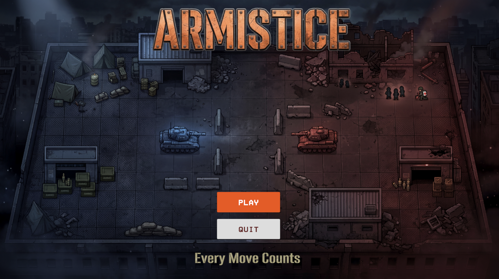
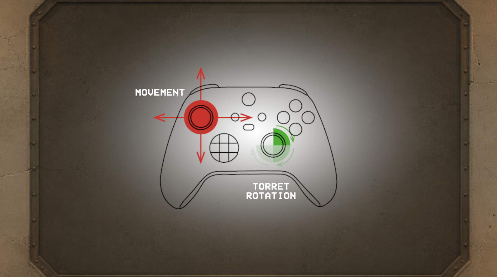
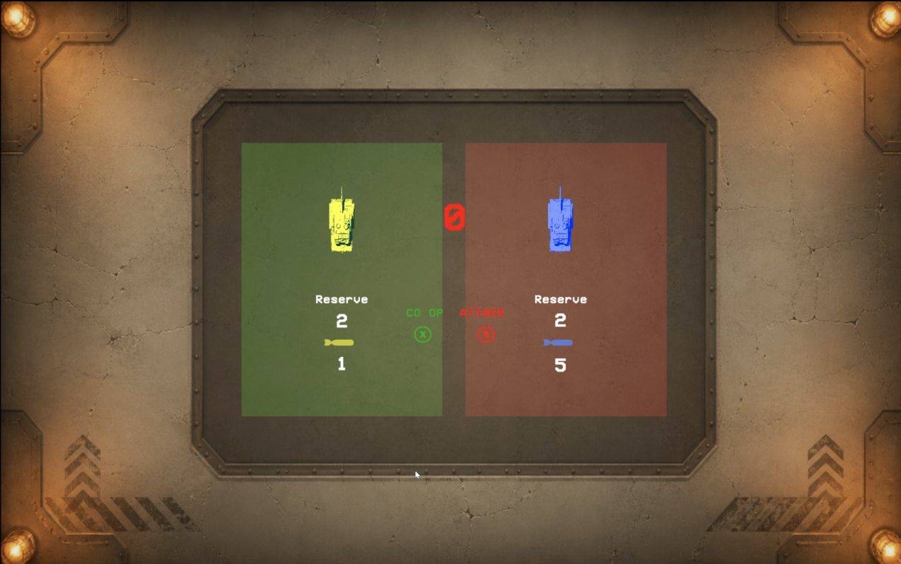
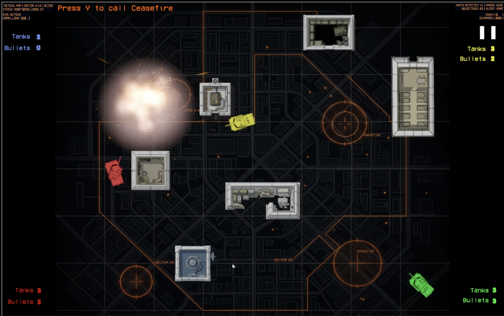
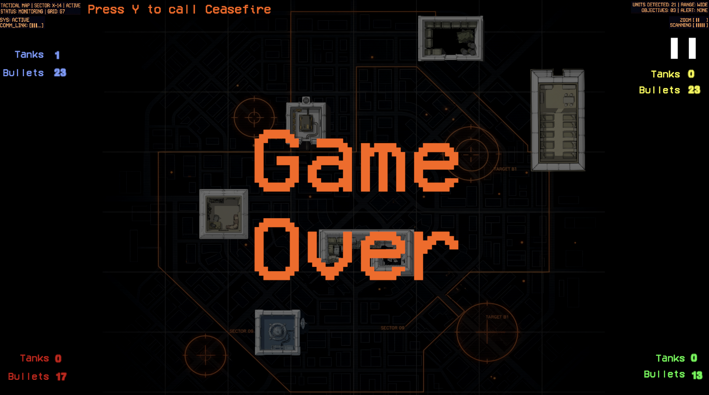

# Armistice

**Trailer:** [Watch on YouTube](https://www.youtube.com/watch?v=Fko-PupBILw)

`Armistice` is a local multiplayer Unity tank game centered on combat, survival, and brief ceasefire decision moments.

**Builds:** Download playable builds from the [GitHub Releases](https://github.com/morrijm4/CT-Game-Design/releases) section.

## Repository Guide

- `AdditionalMaterials/` contains the final presentation PDF, trailer file, and screenshots for evaluation.
- `Assets/Scenes/` contains the main Unity scenes: `MainMenu`, `Instructions`, and `Arena`.
- `Assets/Game Assemblies/Prefabs/Players/Tank.prefab` is the main tank prefab and a useful entry point for understanding how the player object is assembled.
- `Assets/Scripts/` contains the core gameplay and UI scripts.
  Helpful scripts to review first:
  `CeasefireManager.cs`, `CeaseFire/CeasefireController.cs`, `Health.cs`, `Projectile.cs`, `Shooter/Shooter.cs`, `Shooter/PelletShooter.cs`, `Shooter/BombShooter.cs`, `ReturnHome.cs`, and `Respawner.cs`.

## Screenshot Gallery

<table>
  <tr>
    <td align="center" width="50%">
      <strong>Main Menu</strong> 
      
    </td>
    <td align="center" width="50%">
      <strong>Movement Controls</strong> 
      
    </td>
  </tr>
  <tr>
    <td align="center" width="50%">
      <strong>Ceasefire Betrayal Screen</strong> 
      
    </td>
    <td align="center" width="50%">
      <strong>Tank Explosion</strong> 
      
    </td>
  </tr>
  <tr>
    <td align="center" width="50%">
      <strong>Game Over Screen</strong> 
      
    </td>
    <td align="center" width="50%"></td>
  </tr>
</table>

## Technical Note

- Unity version: `6000.3.9f1`
